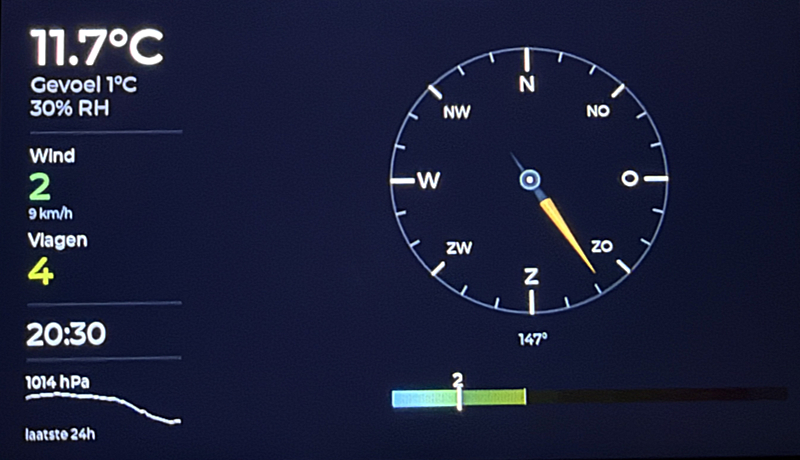
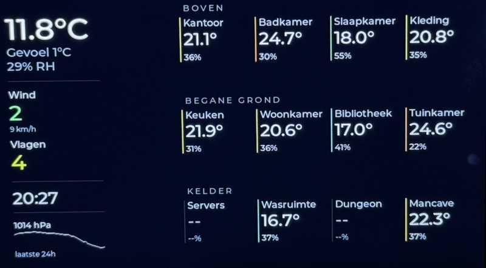

# BUC Panel

Firmware for the Waveshare ESP32-S3-LCD-4.3 panel that acts as a purpose-built client for the BUC server.

## At a glance





The current 4.3 inch client is a compact wall panel with:

- a weather page
- an indoor climate page
- a scene and direct-control page
- swipe-based full-screen navigation

## Current role in the system

The panel is the device-side UI layer in this chain:

1. Home Assistant builds canonical weather, overview, indoor, and scene entities.
2. BUC reads those entities and exposes compact HTTP models.
3. The panel renders those models locally with LVGL and sends control intents back through BUC.

This repository owns:

- local rendering
- touch interaction
- Wi-Fi connectivity
- polling of `GET /api/panel/weather`
- `POST /api/panel/control` intents for page 3

## Current firmware status

Current release milestone:

- `v0.7.0`

This release baseline includes:

- weather page
- indoor page
- page-3 scenes + direct controls
- improved full-panel swipe handling

## Related repositories

- [Brockian-Ultra-Cricket-server](https://github.com/chaoticvoltlabs/Brockian-Ultra-Cricket-server)
  - BUC server and compact panel-facing API layer
- [Brockian-Ultra-Cricket-homeassistant](https://github.com/chaoticvoltlabs/Brockian-Ultra-Cricket-homeassistant)
  - Home Assistant package and payload layer

## Repo layout

- [`main/main.c`](main/main.c)
  - boot, LVGL init, page construction
- [`main/ui_weather.c`](main/ui_weather.c)
  - left weather column
- [`main/ui_pages.c`](main/ui_pages.c)
  - horizontal page navigation
- [`main/ui_indoor.c`](main/ui_indoor.c)
  - indoor climate grid
- [`main/ui_controls.c`](main/ui_controls.c)
  - page-3 scenes and direct controls
- [`main/panel_api.c`](main/panel_api.c)
  - HTTP polling and control POSTs
- [`main/net_wifi.c`](main/net_wifi.c)
  - STA Wi-Fi client
- `main/secrets.h`
  - local credentials and upstream host config, created from `main/secrets.example.h`

## Build

ESP-IDF environment must be active.

Example:

```bash
source /home/icz8922/.espressif/v6.0/esp-idf/export.sh
idf.py build
```

Typical output binary:

- `build/buc_panel_client.bin`

## Flash

Typical commands:

```bash
idf.py -p PORT flash
```

```bash
idf.py -p PORT monitor
```

## Documentation

- [`docs/architecture.md`](docs/architecture.md)
- [`docs/build-and-release.md`](docs/build-and-release.md)
- [`docs/page3-scenes-and-direct-control.md`](docs/page3-scenes-and-direct-control.md)

Historical working notes remain in `local_data` in the private development repo, but repo-facing docs should prefer the `docs/` directory.

## Copyright & license

PolyForm Noncommercial License 1.0.0
with Commercial Use by Explicit Permission Only
See LICENSE.txt


Copyright (c) 2026 Robin Kluit / Chaoticvolt.
