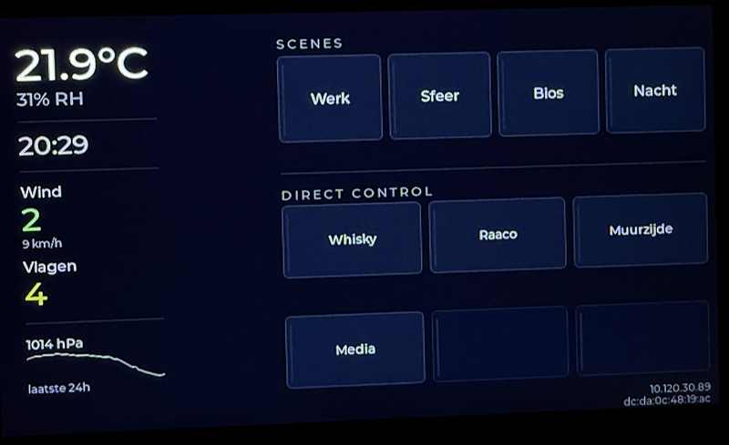

# Waveshare 4.3 ESP32-S3

Live-oriented BUC panel firmware for the Waveshare ESP32-S3-LCD-4.3.

## Pages




- weather page
- indoor climate page
- scenes and direct control page
- swipe-based full-screen navigation

## Role

This is the current compact wall-panel target tied to the BUC server data path.

It owns:

- local rendering
- touch interaction
- Wi-Fi connectivity
- polling of `GET /api/panel/weather`
- `POST /api/panel/control` intents for page 3

## Local setup

Create `main/secrets.h` from `main/secrets.example.h`.

## Build

```bash
cd targets/waveshare-4.3-esp32s3
idf.py build
```

## Main files

- [`main/main.c`](main/main.c)
- [`main/ui_weather.c`](main/ui_weather.c)
- [`main/ui_indoor.c`](main/ui_indoor.c)
- [`main/ui_controls.c`](main/ui_controls.c)
- [`main/panel_api.c`](main/panel_api.c)
- [`main/net_wifi.c`](main/net_wifi.c)
