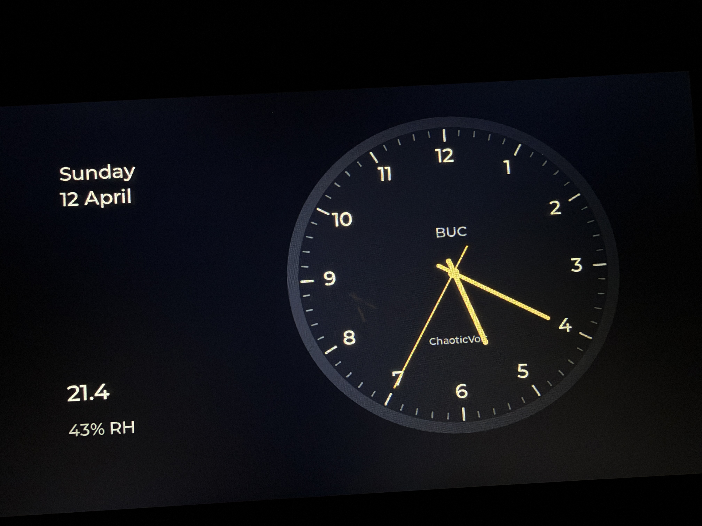
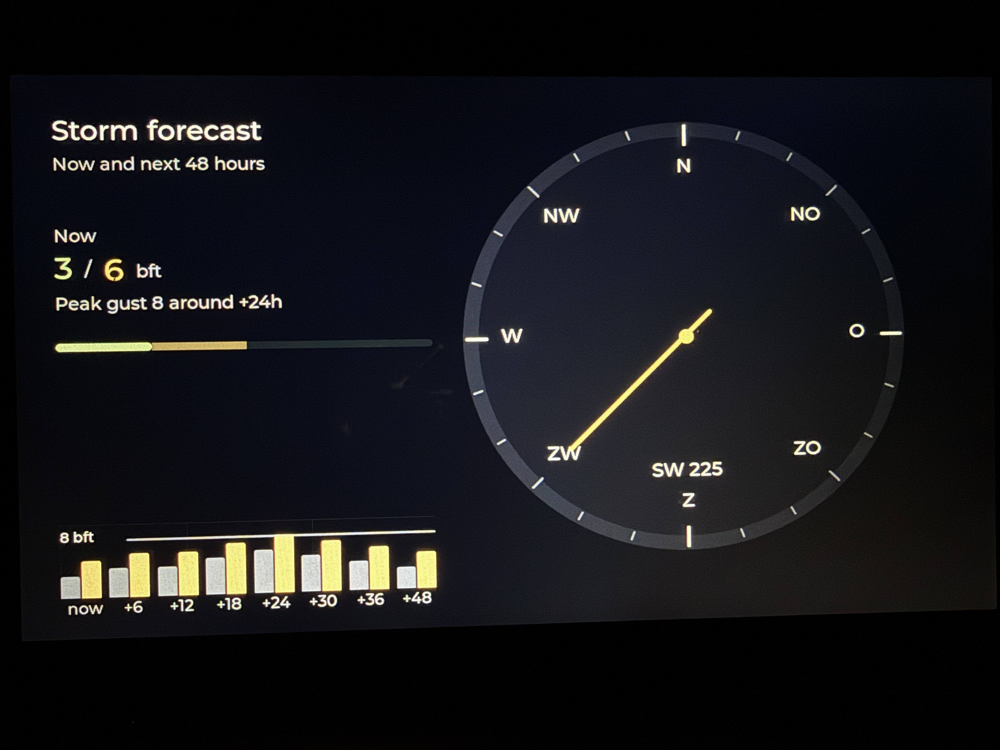
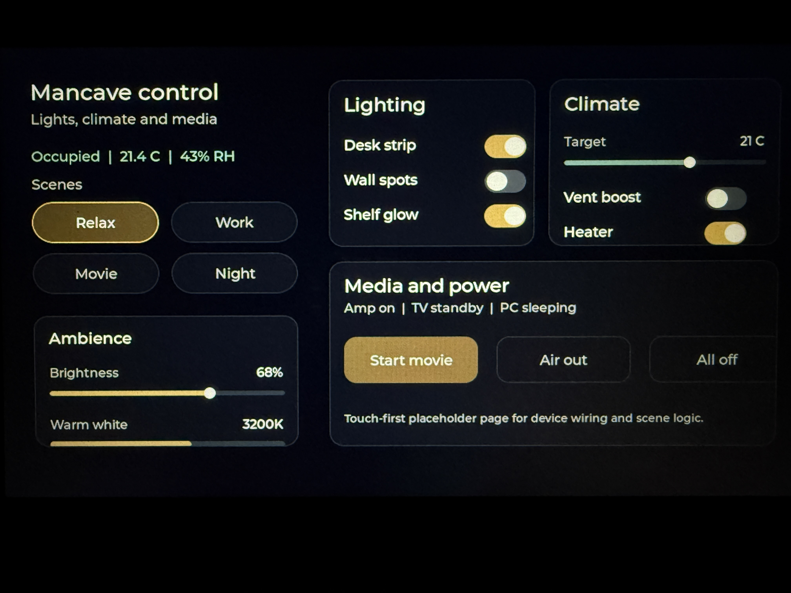

# Waveshare 7B ESP32-S3 Showcase

Reference/showcase firmware for the Waveshare ESP32-S3-Touch-LCD-7B.

## Pages





- page 1: clock
- page 2: storm forecast
- page 3: mancave control showcase

## Intent

This target is intentionally kept as a showcase/reference branch of the UI work.

That means:

- page 3 should be preserved as a design reference
- it should not be the first place where live BUC control logic gets bolted on
- later live integration can branch from this target after the layout language is locked down

## Local setup

Create `main/config.h` from `main/config.example.h`.

## Build

```bash
cd targets/waveshare-7b-esp32s3-showcase
idf.py build
```

## Main files

- [`main/main.c`](main/main.c)
- [`main/clock_ui.c`](main/clock_ui.c)
- [`main/outlook_ui.c`](main/outlook_ui.c)
- [`main/control_ui.c`](main/control_ui.c)
- [`main/display.c`](main/display.c)
- [`main/touch.c`](main/touch.c)
